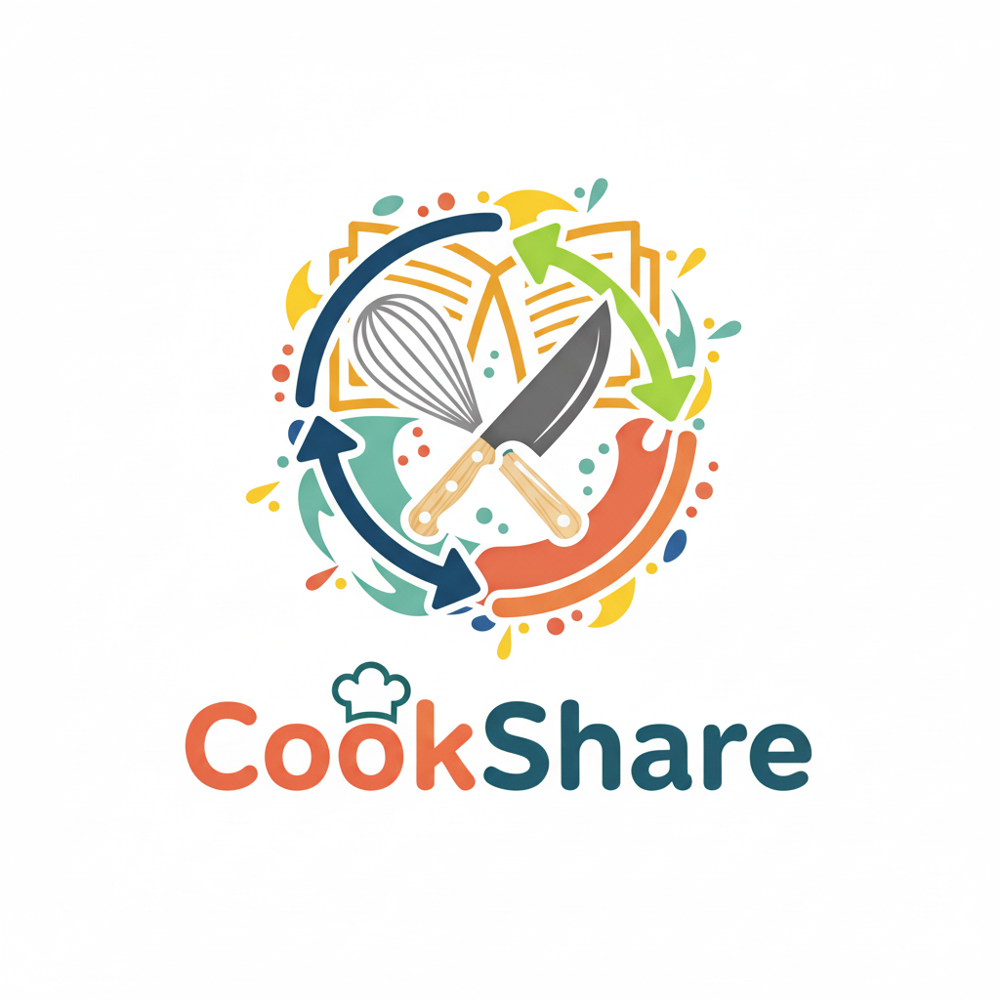

# **CookShare - Social_Group**

## Información de Contacto

| **Nombre** | **Correo** |
|--------|--------|
| Aguirre Ospina Mateo | maguirreo@unal.edu.co |
| Gil Sánchez Juan Sebastián | jgilsan@unal.edu.co |
| Beltran Orjuela Juan David | jbeltrano@unal.edu.co |
| Ramírez Sanchez David Santiago | dramirezsa@unal.edu.co |

## Descripción

 Este proyecto se basa en un programa que será utilizado por los usuarios para leer, buscar y publicar recetas de cocina de diversas categorías, de tal manera que los usuarios pueden interactuar con diversas recetas según sus gustos o estilo de vida. Adicionalmente, tiene la posibilidad de tener interacciones entre los usuarios, como calificaciones, comentarios, etc. Así mismo, una lista de favoritos donde se puede guardar las recetas que más le pueden gustar a las personas.

